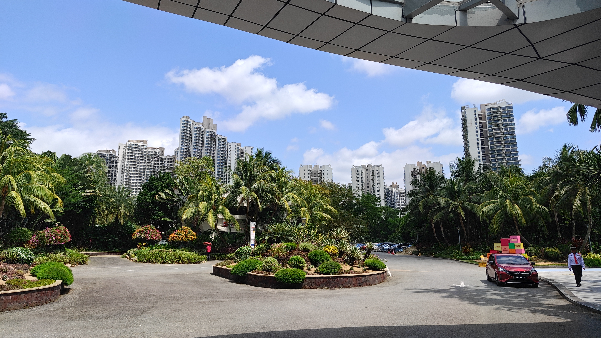
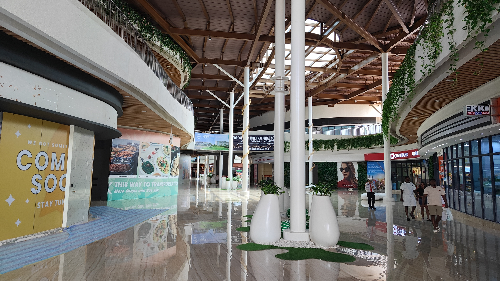
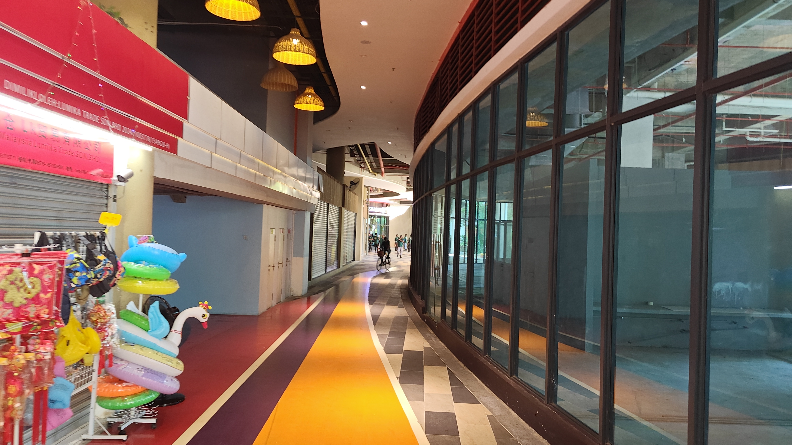
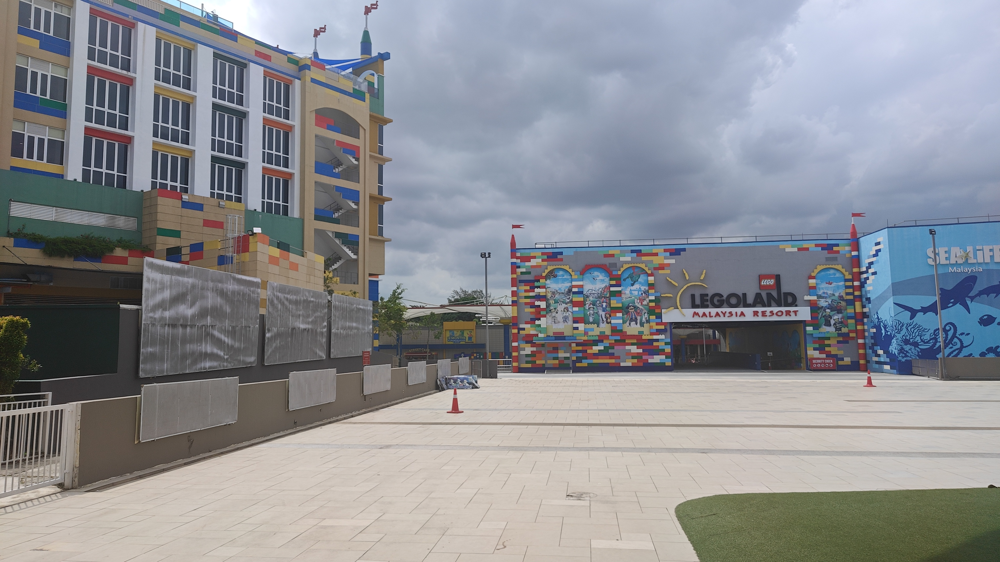
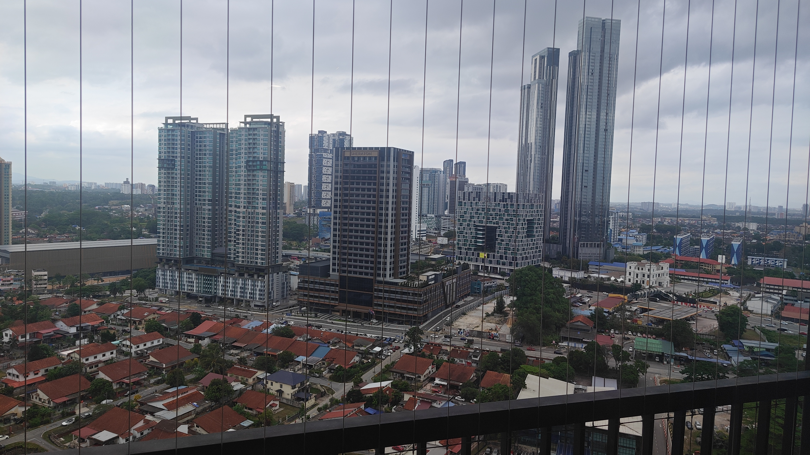
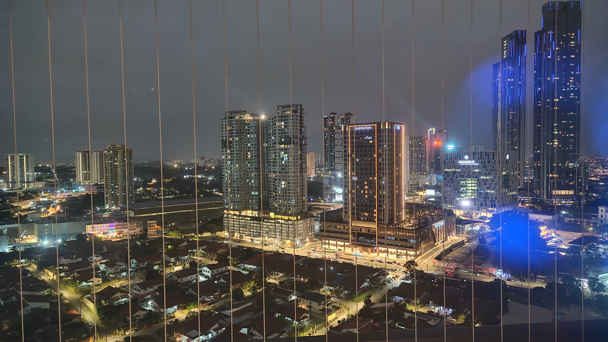

# 前置き:マレーシア移住を考える

東京に住んでいると、やはり生活コストの高騰は緊急の課題となる。  
今年になって、フリーランスの給料も単純な開発の場合は、AIが参入して昨年の２０％ダウンとなった。  
単月100万円を超える案件は、大幅に消え100万未満の案件ばかりになった。

[フリーランスの1,000万円は、会社員の600万円程度](https://note.com/tomosta/n/nf056d6f94f28)

こちらの記事のように、本当に1000万と言えば聞こえがいいが、実質は600万程度である。
消費税はかかり、保険料も自費なのでひかれ、本当に600万程度しか残らない。

経費の自由が認められるだけで、実際の手取りは抑えられるというのが現実である。

そうなってくると、**日本の地方に飛ぶか、低コストの国外でコストを下げる**ことを考えることになる。

フリーランスで何年もできるような人間は、基本的に挑戦ありきだと思っている。
やってみるとわかるのだが、額面がよくても割に合わないことの連続だ。

**海外に住む挑戦をしてみたい。**

そう思ったから、今回のマレーシアを計画したのである。

# マレーシア全体の所感

## 治安

正直、治安の良さにびっくりしている。

|ランキング|国名|
|--|--|
|11位| チェコ|
|12位| 日本|
|13位| マレーシア|
|14位| カナダ|
|14位| オランダ|

[世界平和指数ランキング。世界各国の治安・安全性ランキング](https://worldinvest.jp/anzenranking/)

ランク的に、日本との差が１０位ぐらいあると思っていたのだが、もう僅差である。  
むしろ、日本は最も治安が良い国では、なくなりつつあるようであることを残念に思う。

## 言語

基本的に、**英語**が通じる。  
これが、ベトナムとは大きな差になってくる。

公用語は、マレー語ではあるが、他民族国家なので英語がよく通じる。

中学英語ぐらいできれば、何も問題は生じない。  
独特のナマリはあるが、よく聞けばわかる。

## お金

### 通貨
**1RM（リンギット）が約40円前後**（2026/01月）

### タクシー相場
**20km 約800円(20RM)**

### 電車
長距離移動も、短距離も安い

### ご飯
50RM出せば、大抵食べれる。  
100RM超えれば、もうかなり良いものを食べている感覚

気持ち、東京の1/3〜2/3ぐらいの感覚である。

完全比較すると

|店舗|日本|マレーシア|
|----|---|---|
|PizzaHat（１人用コンボ）|1500円前後|17RM(680円前後)|
|KFC（６本）|3000円前後|20RM(800円前後)|

### 海外製品

大体同じぐらいの値段。  
贅沢に、海外製品を揃えようとしたら生活費はさがらない。

## 物流

モールには、多数の海外製品があり、日本で手に入るものは大抵、手に入る。  
どうしても**日本製品が欲しい場合には、手に入る印象が強い。**

## 文化/環境

前情報では陽気な人が多く、ニコニコしてれば良いとの話だったが、まぁ普通にしてればよい。

イスラム教、トイレの横に礼拝室があることが多いが、特に気にはならない。強いて言うなら、**豚肉は特定のところでしか食べれない。お酒は売る場所が限られている。左手はあまり使わない。指差し、異性への接触は避ける。** これぐらいだろうか？

ただ、まぁ意識しなくても…ぐらいの感じである。

軍は、あまりみることはない。（流石に、政府組織にはいたが・・・）

日本人としては、気になるところだが、中国の人は結構多く感じる。  
３割は中国人の方と考えた方がいい。

排ガス: 許容範囲内.  
虫:　前情報では、コバエが結構と聞いたが、冬なのか、いない。　　

## 医療

未調査

## 気になるポイント

### 冷房効きすぎ問題

さまざまな乗り物や施設で、設定温度が大幅に異なる。  
**常夏の国ではあるが、長袖を携帯することをオススメ**する。
ヒドイと設定温度が１７度前後だったりするので、寒暖差でやられる。

### コンセントにスイッチ

SDGsの一つなのか、全コンセントにスイッチがあり、通電してると思ったら、通電してないことあり。大概、コンセントにスイッチついてるので、スイッチをいれること。

# ジョホールバル（JB）

マレーシア移住先の候補として、ジョホールバル（JB）を視察した。
シンガポールの隣に位置し、生活コストが大幅に抑えられるエリアとして注目されている。

今回は、JB内の3つのエリアを回った。

## 経済特区フォレストシティ

JBからGrabで30分以内の距離にある、中国資本の大型経済特区。

結論から言うと、**完全なゴーストタウン**だった。

建設途中のまま放置された建物が目立ち、住居用のコンドミニアムも空き部屋が多い印象を受けた。
モール自体は存在していたが、**中はガラガラ**で、活気はほとんど感じられなかった。

住む場所としては、全く選択肢に入らない。
理由は複合的で、**人がいなすぎる、交通が不便、将来性が不透明**の三拍子が揃っている。

Grabでしかアクセスできないような場所で、公共交通機関が整備されていない以上、生活が成り立たない。

## レゴランド周辺

大阪でいうところの、2026年段階の堺東のような印象がある。
一度は栄えたが、もう一度立て直しをしているといった感じだった。

雰囲気としては**ファミリー向け**で、戸建ての住宅街が広がっている。
高級住宅街も販売されていたが、不動産関係者は**全員中国の方**で、マレー人の方が経営している印象がなかった。
一応マレーシア人向けに販売しているが、裏口で海外の方でも住むことは可能なようだ。（名刺は一応もらったが、多分住むことはない）

課題としては、**車がないと絶対に不便**。
商業施設が少なく、街全体がまだ発展途上で、郊外といった印象がかなり強かった。

## JB Sentral周辺

JBで訪れた中では、**最も活気があるエリア**だった。
ただし、KLには劣るというのが正直な印象である。

治安は特に問題なく、安全だと感じた。
交通の利便性は非常に高く、シンガポールへのアクセスも良い。

JB Sentral駅は現在拡張中で、**電車が発達する未来は見えている**。5年後には期待ができる。

ただし、今すぐ投資となると話は別で、**駅が完成する1年前ぐらいに投資した方がよさそう**な印象を受ける。

駅近くには大型モールがあり、大抵の海外製品や自国製品は手に入る。
しかし、やはり**車がないと厳しい**印象は拭えなかった。

KLと比較すると、新設のコンドミニアムを建てているので設備自体は新しく、上物としての価値はあるかもしれない。

### 家賃相場

**高級高層マンションでも3,500RM/月（約14万円）前後**と、比較的安い。
東京の同等グレードのマンションと比較すると、半額以下の水準である。
