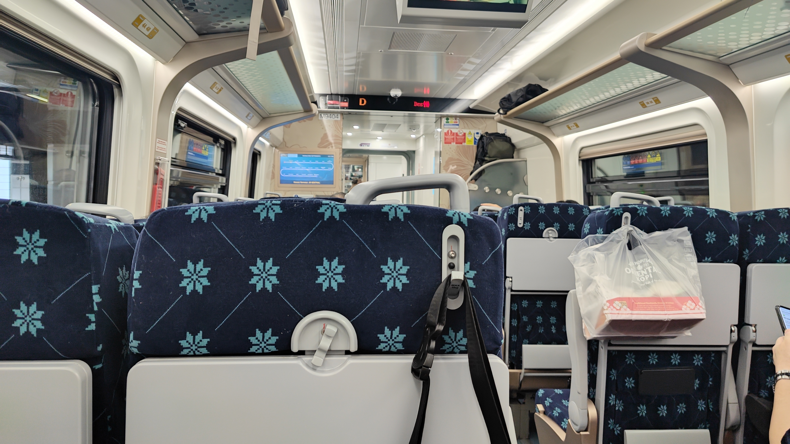
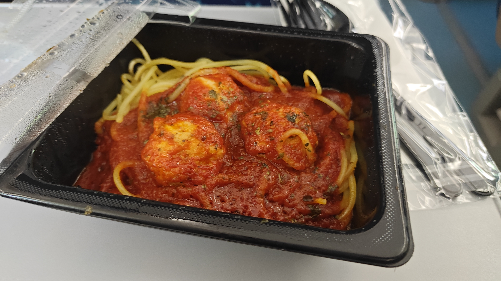
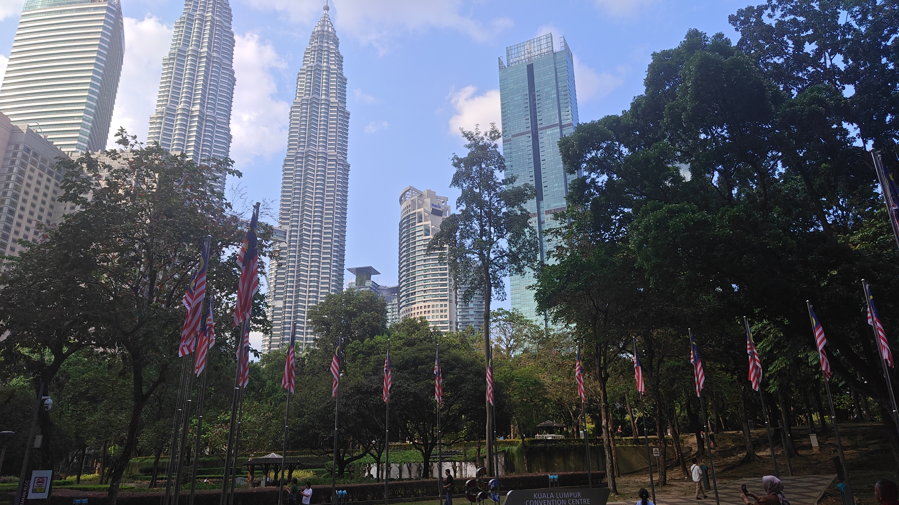
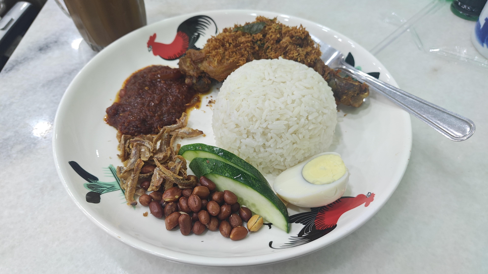
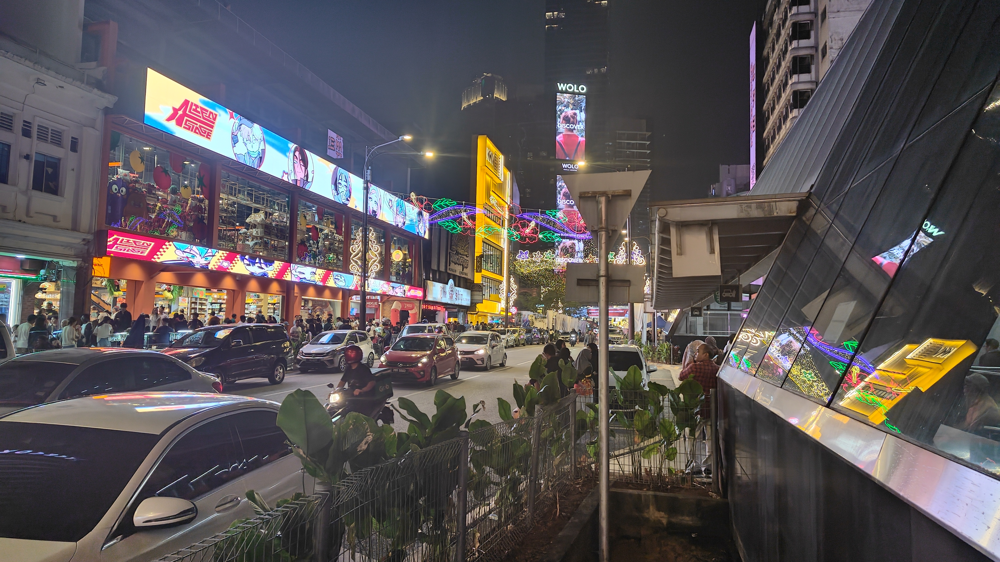
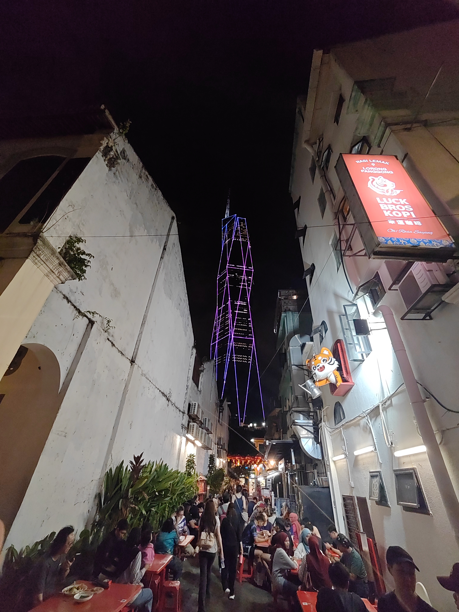
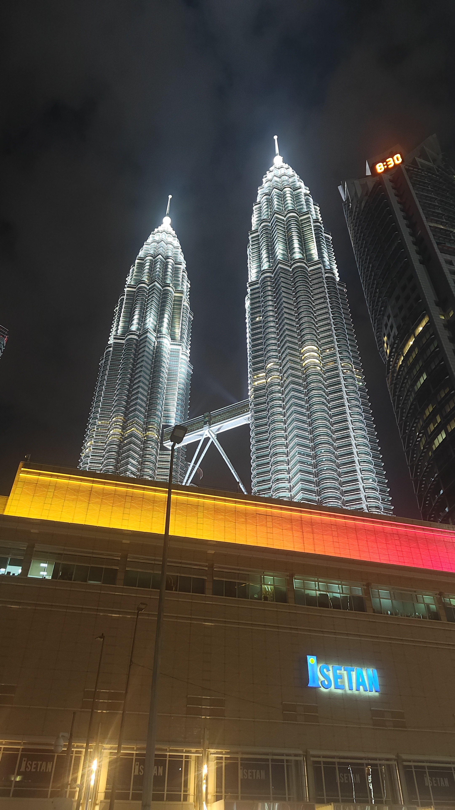

# JBからKLへ：KTMで4時間半の電車旅

JBの視察を終え、次の候補地であるKL（クアラルンプール）へ向かった。

移動手段として、2025年に開通したばかりのKTM（Keretapi Tanah Melayu）を利用した。
料金は**98RM（約3,920円）**と飛行機よりも格安。

所要時間は約4時間半の長旅ではあるが、空港までの移動と空港からの移動を考えると、飛行機と同じくらいの時間がかかる。
それなら、KTMの方が断然快適だ。

車内には食堂のような販売店もあり、旅としても楽しめる。

ただし、やはり**エアコンが18度設定**で、Part1で書いた「冷房効きすぎ問題」が健在だった。長袖は必須である。

# クアラルンプール（KL）

## 交通・移動

### 電車（MRT/LRT）

KLの電車はそれなりに便利で、主要エリアはカバーできる。
JBと違い、**車がなくてもなんとか生活できる**レベルだ。

ただし、路線図が難しい。大阪や東京よりはマシだが、**全交通機関の運営会社が異なる**という問題がある。
そのため、駅同士のつながりが非常に不便で、乗り換えに苦労する場面があった。

### Grab

JBに比べると、**距離あたりの料金が高い**印象を受けた。
また、Grabが来るまでの待ち時間もJBより長く、**最長で15分程度**待つこともあった。

とはいえ、電車とGrabを組み合わせれば、車なしでも生活は成り立つ。
JBでは「車がないと無理」だったが、KLでは「工夫すればいける」レベルだ。

## 住環境・家賃

JBの高級コンドが3,500RM/月だったが、KLでも**3,500RM〜**で探せる物件はある。
正直、**JBとKLを比較するとKL一択**になる。同じ価格帯でも、KLの方が生活の利便性が圧倒的に高い。

ただし、KLは古い物件も多く、**上物の価値としてはJBの新築の方が上**という印象がある。

### インフラのトラブル

古い物件が多い分、インフラ周りにトラブルが少々ある。

- **水回りの問題**：水漏れや排水の問題
- **エレベーターのアルゴリズムが悪い**：高層コンドのエレベーター待ちが5分以上かかることがあり、地味にストレスになる

物件選びの際には、設備の新しさも重要なポイントになる。

## 食事・生活コスト

食事のコストは**JBと同程度で安い**。
Part1で書いた「東京の1/3〜2/3」の感覚は、KLでも変わらなかった。

都心部だからといって極端に高くなることはなく、この点はKLの大きなメリットだ。

## ブキビンタン

何か困ったらブキビンタンで買えばいい。**大概のものはブキビンタンで揃う**。

特に印象的だったのが、5階建ての機械系専門ビル**「プラザ ローヤット（Plaza Low Yat）」**の存在だ。
ワンフロア全てがセカンドハンドのスマホだったり、セカンドハンドのPC/パーツだったり、新品も集まるビルである。

2次元オタクの街というよりは、**PCオタクの聖地**。
壊れたら修理する文化、セカンドハンドのハードウェアの多さは、今の日本にはない感覚だ。

もしかしたら、**機械系のランニングコストはマレーシアの方が安い**かもしれない。

## チャイナタウン

観光地感が強かった。
住む場所としてというよりは、観光で訪れるエリアという印象だ。

## WiFi/ネット環境

フリーランスとしては気になるポイントだが、結論としては**「そこそこ」**。

ちょうど、東大の講座をマレーシアで受講していたが、**たまに音声が途切れる**程度だった。
テキストベースの作業なら問題ないが、ビデオ会議が多い場合は、回線環境の確認が重要になる。

# 総括：JB vs KL

|項目|JB|KL|
|---|---|---|
|家賃|高級でも3,500RM〜|3,500RM〜（同等だが利便性が高い）|
|交通|車がないと無理|車なしでもなんとかなる|
|食費|東京の1/3〜2/3|JBと同程度|
|生活利便性|モールはあるが限定的|ブキビンタンで大概揃う|
|将来性|3年後に期待（駅拡張）|すでにインフラが整っている|

**結論：マレーシアに住むならKL一択。**

JBは3年後が最高潮になる可能性があり、シンガポールとのやりとりがあるなら検討の価値はある。
それ以外でマレーシアに住むのであれば、KLを選ばない理由がない。

経済特区は…まぁ、安くしてなんとか外貨を入れようという感じが否めない。

## 2026年の懸念

2月5日、マレーシアは経済成長率を上方修正している。
このペースだと、**1RM＝50円に到達するのは今年中**に訪れそうである。

RMが50円になると、さすがに日本との生活コストの差が縮まり、マレーシアに住むメリットが薄れてくる。
住むのであれば、**今年いっぱいがリミット**だろう。

次の安い国を探す旅がはじまる。
